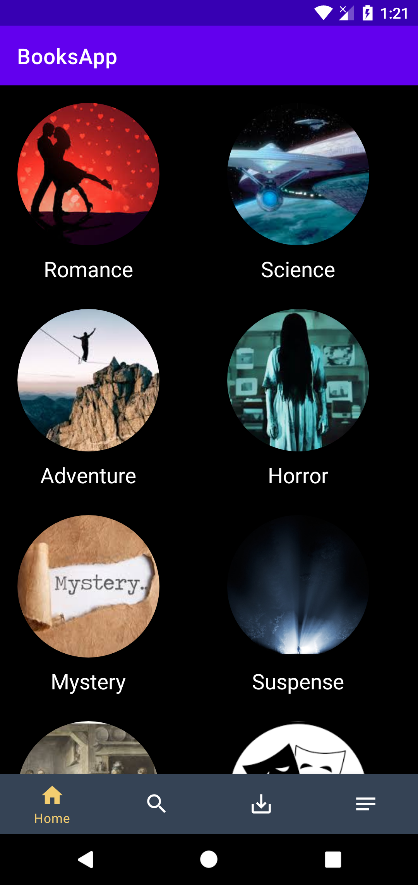
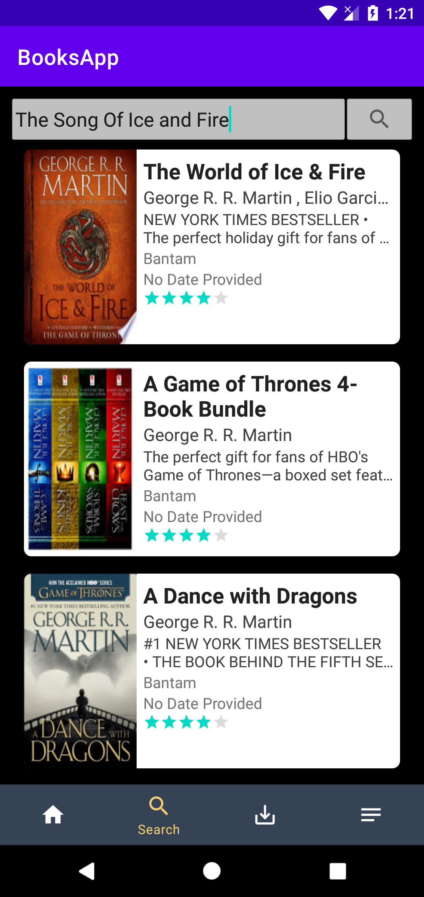

# BooksApp

Features

<ul>
  <li>Navigation Drawer</li>
  <li>Fragments</li>
  <li>Loaders</li>
  <li>Intent</li>
  <li>Google Books Api</li>
  <li>JSON Parsing</li>
  <li>Glide</li>
  <li>CardView</li>
  <li>RecyclerView</li>
  <li>SQLite Database</li>
  <li>Cursors</li>
  <li>Content Provider</li>
</ul>

   
  
